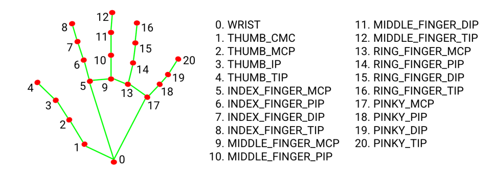
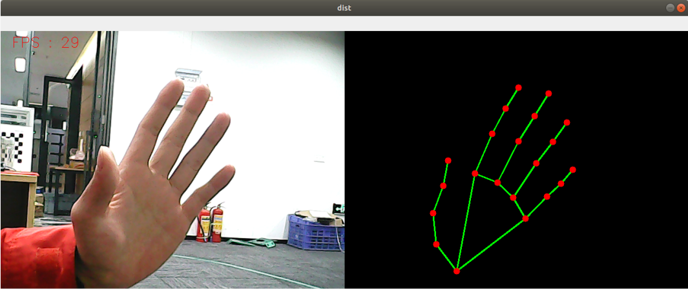

# 1.Hand detection

### 1.1 MediaPipe Hands

MediaPipe Hands is a type of high fidelity case tracking and resolution system. It uses machine learning (ML) to infer 21 3D coordinates from frames.

After palm detection of the entire image, precise key point localization of 21 3D joint coordinates within the detected region is performed through regression based on a part labeling model, i.e. direct coordinate prediction. This model learns the internal pose table of the human body, and is even robust to partially observable human body and self occlusion.

In order to obtain real-world data, 21 3D coordinates were used to dynamically annotate approximately 30K real-world images, as shown below (obtaining Z values from the image depth map, if each corresponding coordinate has a Z value). In order to better cover possible body postures and provide additional supervision on the properties of the body, a high-quality synthetic body model was drawn in various backgrounds and mapped to the corresponding 3D coordinates.



### 1.2 Hand detection

#### 1) Start

Input following command:

```
roscore
rosrun yahboomcar_mediapipe 01_HandDetector.py
```



#### 2) Code

Code path:/home/yahboom/orbbec_ws/src/yahboomcar_mediapipe/scripts/01_HandDetector.py

```python
#!/usr/bin/env python3
# encoding: utf-8
import rospy
import time
import cv2 as cv
import numpy as np
import mediapipe as mp
from geometry_msgs.msg import Point
from yahboomcar_msgs.msg import PointArray

class HandDetector:
    def __init__(self, mode=False, maxHands=2, detectorCon=0.5, trackCon=0.5):
        self.mpHand = mp.solutions.hands
        self.mpDraw = mp.solutions.drawing_utils
        self.hands = self.mpHand.Hands(
            static_image_mode=mode,
            max_num_hands=maxHands,
            min_detection_confidence=detectorCon,
            min_tracking_confidence=trackCon )
        self.pub_point = rospy.Publisher('/mediapipe/points', PointArray, queue_size=1000)
        self.lmDrawSpec = mp.solutions.drawing_utils.DrawingSpec(color=(0, 0, 255), thickness=-1, circle_radius=6)
        self.drawSpec = mp.solutions.drawing_utils.DrawingSpec(color=(0, 255, 0), thickness=2, circle_radius=2)

    def pubHandsPoint(self, frame, draw=True):
        pointArray = PointArray()
        img = np.zeros(frame.shape, np.uint8)
        img_RGB = cv.cvtColor(frame, cv.COLOR_BGR2RGB)
        self.results = self.hands.process(img_RGB)
        if self.results.multi_hand_landmarks:
            
            for i in range(len(self.results.multi_hand_landmarks)):
                if draw: self.mpDraw.draw_landmarks(frame, self.results.multi_hand_landmarks[i], self.mpHand.HAND_CONNECTIONS, self.lmDrawSpec, self.drawSpec)
                self.mpDraw.draw_landmarks(img, self.results.multi_hand_landmarks[i], self.mpHand.HAND_CONNECTIONS, self.lmDrawSpec, self.drawSpec)
                for id, lm in enumerate(self.results.multi_hand_landmarks[i].landmark):
                    point = Point()
                    point.x, point.y, point.z = lm.x, lm.y, lm.z
                    pointArray.points.append(point)
        self.pub_point.publish(pointArray)
        return frame, img

    def frame_combine(slef,frame, src):
        if len(frame.shape) == 3:
            frameH, frameW = frame.shape[:2]
            srcH, srcW = src.shape[:2]
            dst = np.zeros((max(frameH, srcH), frameW + srcW, 3), np.uint8)
            dst[:, :frameW] = frame[:, :]
            dst[:, frameW:] = src[:, :]
        else:
            src = cv.cvtColor(src, cv.COLOR_BGR2GRAY)
            frameH, frameW = frame.shape[:2]
            imgH, imgW = src.shape[:2]
            dst = np.zeros((frameH, frameW + imgW), np.uint8)
            dst[:, :frameW] = frame[:, :]
            dst[:, frameW:] = src[:, :]
        return dst

if __name__ == '__main__':
    rospy.init_node('handDetector', anonymous=True)
    capture = cv.VideoCapture(0)
    capture.set(6, cv.VideoWriter.fourcc('M', 'J', 'P', 'G'))
    capture.set(cv.CAP_PROP_FRAME_WIDTH, 640)
    capture.set(cv.CAP_PROP_FRAME_HEIGHT, 480)
    print("capture get FPS : ", capture.get(cv.CAP_PROP_FPS))
    pTime = cTime = 0
    hand_detector = HandDetector(maxHands=2)
    while capture.isOpened():
        ret, frame = capture.read()
        # frame = cv.flip(frame, 1)
        frame, img = hand_detector.pubHandsPoint(frame, draw=False)
        if cv.waitKey(1) & 0xFF == ord('q'): break
        cTime = time.time()
        fps = 1 / (cTime - pTime)
        pTime = cTime
        text = "FPS : " + str(int(fps))
        cv.putText(frame, text, (20, 30), cv.FONT_HERSHEY_SIMPLEX, 0.9, (0, 0, 255), 1)
        dist = hand_detector.frame_combine(frame, img)
        cv.imshow('dist', dist)
        # cv.imshow('frame', frame)
        # cv.imshow('img', img)
    capture.release()
    cv.destroyAllWindows()
```

